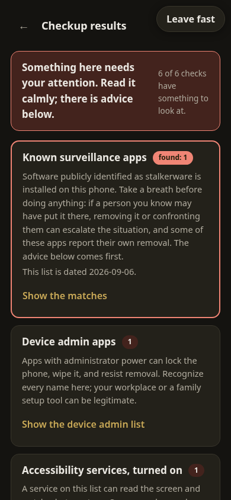
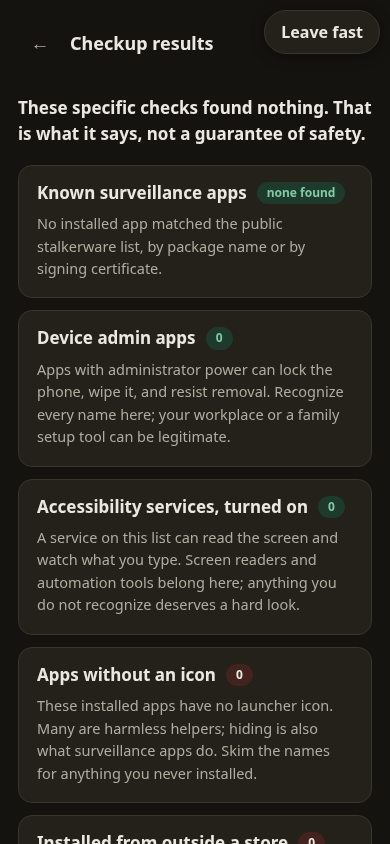

# Sweep

  

A plain-language phone checkup. Beta.

Somebody wondering whether their phone is watching them has two options
today: closed-source scanner apps that ask to be trusted blindly, or
serious forensic tools that need a second computer and a trained
advocate. Sweep sits in the gap: open source, runs on the phone itself,
and explains what it finds in sentences.

The checks. Installed apps get compared against Echap's public
stalkerware-indicators dataset, by exact package name, by wildcard family
prefix, and by signing certificate so a renamed copy still matches. Then
the phone's own risk surfaces get listed with plain explanations: device
admin apps, enabled accessibility services, apps that can read
notifications, apps with no launcher icon, and apps installed from
outside any store. Every flagged entry carries when it was installed and
by what, most recent first, and a match also says what other power it
holds on the phone right now.

Since 0.5.0 the scan reads everything Android exposes to an unprivileged
app, and the honesty model is part of the product: every result opens
with how many surfaces were read out of how many Sweep knows exist, and
names each one it could not read with the concrete reason, including the
three grant lists Android reserves for privileged system apps. Findings
carry the raw evidence and the exact rule that fired; match wording is
tiered by evidence strength, so a certificate match speaks more plainly
than a package-name match ever does; openly sold parental-monitoring
apps live on a separate track with separate wording, because presence is
not proof of misuse; and the disguise check needs a broken trust anchor,
never just a familiar-looking name. An unreadable surface is reported as
unknown rather than skipped, which is the difference between found
nothing and looked at nothing.

The language is the product as much as the code. Sweep never says "you
are safe", because no checkup can know that; a clean run says "these
specific checks found nothing" and means it. A match leads with the
warning that matters: removing stalkerware or confronting the person who
installed it can escalate a dangerous situation, talk to an advocate
first, and the hotline numbers are right there. Results are never stored,
and a Leave fast button sits on every screen.

  
  

## Get it

Android only, by design: install [sweep.apk](https://github.com/munzzyy/sweep/releases/latest/download/sweep.apk)
on Android 10 or newer. Sweep is not in the Play Store, so Android will
warn you before it installs: something like "For your security, your
phone is not allowed to install unknown apps from this source." That
warning exists for apps in general, not for Sweep specifically; tap
Settings in that prompt, allow installs from your browser or file
manager, then install the file again. [Obtainium](https://github.com/ImranR98/Obtainium)
is a free app that watches a GitHub release link like this one and
offers you updates automatically, so you do not have to come back and
redownload by hand; it is optional. The same UI opened in a plain browser
(`app/index.html`) explains the checks but cannot run them, because a
web page cannot and should not see your installed apps.

## Trust math

Two sentences before the detail: Sweep can see your app list, and it
cannot reach the internet, so nothing it sees can leave your phone. The
rest of this section is how that promise gets checked.

One permission that grants anything: QUERY_ALL_PACKAGES, which IS the
checkup (androidx's inert self-scoped marker rides along, as it does in
every modern app). No INTERNET permission, so nothing Sweep sees can
leave the phone, enforced by the OS and checkable in the manifest. The
indicator data ships inside the app as a pinned snapshot with
attribution (CC-BY 4.0, Echap), refreshed before each release by
`tools/fetch-indicators.py` and stamped with its fetch date inside the
JSON, never fetched at runtime. QUERY_ALL_PACKAGES makes
this app a poor fit for Play's policies; it is built for F-Droid and
sideloading, where the tradeoff can be explained instead of buried.

`npm test` runs the matcher against the real dataset with positive and
negative controls. `npm run e2e` drives the page with stubbed scans: a
planted stalkerware package must surface with the family named, and a
clean scan must produce the hedged found-nothing language, never a
verdict.

## iOS

There is a native iOS wrapper in `ios/`, and it cannot run the checkup.
`QUERY_ALL_PACKAGES`, device admins, and accessibility services are all
Android concepts with no iOS equivalent, so the wrapper shows the same
explainer-only mode a plain browser sees and points at the Android APK for
the actual checks. Today that means an iPhone has no working checkup to
install: not from the App Store (Sweep is not on it), and not as a
website either, because `app/` is not hosted anywhere public yet.
[docs/IOS.md](docs/IOS.md) has the honest version of why, and what
building the wrapper yourself from source looks like if you want to read
the explainer as a real app in the meantime.

## Bugs, verification, contributions

False reassurance is the failure mode that hurts people, so a check that
misses what it claims to catch is the bug that matters;
[SECURITY.md](SECURITY.md) has the private route.
[docs/THREAT-MODEL.md](docs/THREAT-MODEL.md) says exactly what each
check can and cannot see. Releases list the APK's sha256 and signing
certificate digest. Issues and pull requests are open and welcome.

## Beta means beta

The plan of record is review by the organizations that do this work
(NNEDV, the Coalition Against Stalkerware) before Sweep is promoted to
anyone in crisis. Until then it is one tool with stated limits, not an
authority.

MIT. Indicator data CC-BY 4.0 by Echap.
